# Unidad 2 — Analítica Visual: Imágenes como Datos

# Imágenes digitales: de la escena real al tensor

## ¿Qué es una imagen digital?

Una imagen puede entenderse, en primer lugar, como una representación visual de una escena. En el mundo físico, esa escena es continua: la luz cambia suavemente en el espacio, los colores no aparecen separados en cuadros perfectos y los bordes de los objetos no están hechos naturalmente de píxeles.

Sin embargo, un computador no puede almacenar una escena continua. Para trabajar con imágenes, necesita convertir esa información en una estructura finita de números.

Una imagen digital es, por tanto, una aproximación numérica de una escena visual.

```text
Escena real
    ↓
Captura
    ↓
Muestreo espacial
    ↓
Cuantización
    ↓
Imagen digital
```

Esta idea será fundamental para comprender todo lo que viene después. Una imagen digital no es la realidad: es una representación discreta, finita y manipulable de ella.

---

## Dos formas de representar imágenes: raster y vector

Existen dos grandes formas de representar imágenes en un computador:

- imágenes raster;
- imágenes vectoriales.

Aunque ambas pueden verse como imágenes en pantalla, internamente son muy diferentes.

---

## Imágenes raster

Una imagen raster está formada por una matriz de pequeños elementos llamados píxeles. Cada píxel almacena un valor numérico asociado al color o intensidad de una pequeña región de la imagen.

Por ejemplo, una imagen en escala de grises puede representarse como una matriz:

```text
120 123 125 130
118 121 124 129
115 119 122 128
```

Cada número representa la intensidad de un píxel.

<center>
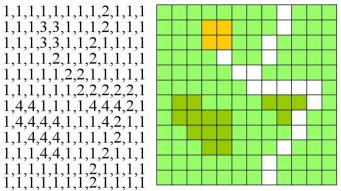
</center>

En una imagen RGB, cada píxel no contiene un único valor, sino tres valores:

```text
R, G, B
```

Es decir, rojo, verde y azul.

Por esta razón, una imagen RGB puede entenderse como tres matrices superpuestas: una para el canal rojo, una para el canal verde y una para el canal azul.

<center>

</center>

Las imágenes raster son las más utilizadas en fotografía, cámaras digitales, visión por computador y redes neuronales convolucionales.

Algunos formatos raster comunes son:

- JPG o JPEG;
- PNG;
- BMP;
- TIFF;
- GIF.

---

## Imágenes vectoriales

Una imagen vectorial no se almacena como una matriz de píxeles. Se almacena como una colección de objetos geométricos: puntos, líneas, curvas, polígonos, círculos y trayectorias.

Por ejemplo, un archivo SVG puede contener instrucciones como:

```xml
<circle cx="100" cy="100" r="50" fill="blue" />

<polygon points="10,10 100,10 100,100" fill="red" />
```

En este caso, la imagen no está definida píxel por píxel, sino mediante fórmulas geométricas.

<center>
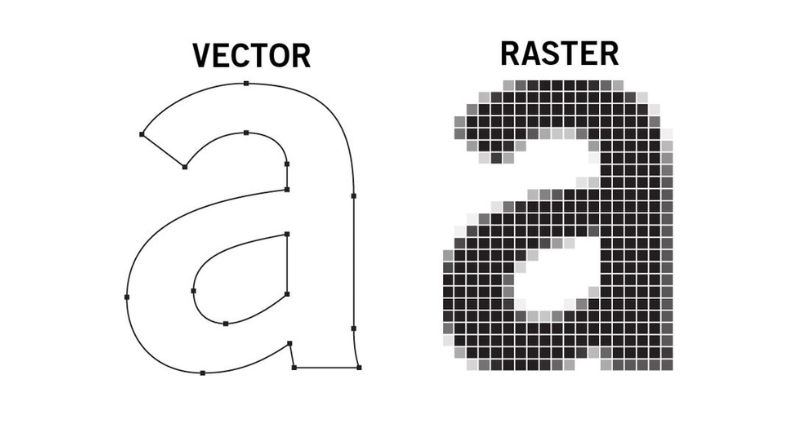
</center>


La principal ventaja de una imagen vectorial es que puede escalarse sin perder calidad. Un logo vectorial puede imprimirse en una tarjeta pequeña o ampliarse para una valla publicitaria sin pixelarse.

Las imágenes vectoriales son comunes en:

- logos;
- diagramas;
- íconos;
- planos;
- ilustraciones;
- diseño gráfico;
- CAD.

Algunos formatos vectoriales comunes son:

- SVG;
- AI;
- CDR;
- DWG;
- EPS.

Para visión por computador y redes neuronales, normalmente trabajamos con imágenes raster, porque los modelos reciben matrices o tensores de valores numéricos.

---

## El píxel

Un píxel suele imaginarse como un punto, pero esa idea puede ser engañosa.

Un píxel representa una pequeña región de la imagen. Es una muestra de la escena original. Cuantos más píxeles tenga una imagen, más detalle espacial puede representar.

Una imagen de tamaño:

```text
640 × 480
```

tiene 640 píxeles de ancho y 480 píxeles de alto.

El número total de píxeles es:

```text
640 × 480 = 307200 píxeles
```

<center>
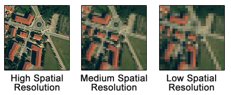
</center>


---

## Resolución espacial

La resolución espacial indica cuántas muestras se toman de la escena en el plano de la imagen.

Algunos tamaños comunes son:

| Nombre | Resolución |
|---|---:|
| VGA | 640 × 480 |
| HD | 1280 × 720 |
| Full HD | 1920 × 1080 |
| 4K | 3840 × 2160 |
| 8K | 7680 × 4320 |

Una imagen con baja resolución puede verse bien si se muestra pequeña. Pero si se amplía demasiado, los píxeles se hacen visibles y aparece el efecto de pixelación.

La resolución no debe confundirse con la calidad total de la imagen. Una imagen puede tener muchos píxeles y aun así verse mal si está desenfocada, muy comprimida o mal iluminada.

---

## Cuantización

El mundo físico es continuo, pero el computador almacena números discretos.

La cuantización es el proceso mediante el cual un valor continuo se aproxima usando un conjunto finito de valores posibles.

Por ejemplo, si representamos una intensidad usando 8 bits, tenemos:

```text
2^8 = 256 valores posibles
```

Normalmente estos valores se escriben como:

```text
0, 1, 2, ..., 255
```

donde:

- 0 representa ausencia de intensidad;
- 255 representa intensidad máxima.

<center>
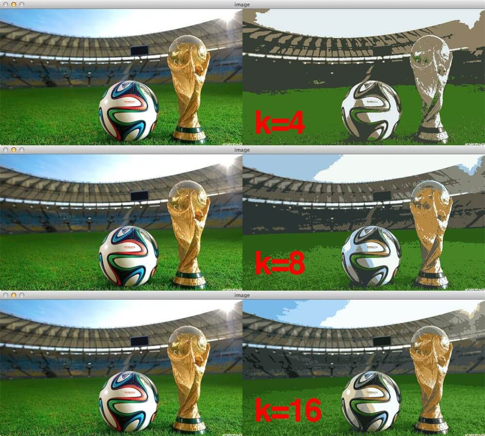
</center>


En una imagen en escala de grises de 8 bits, cada píxel puede tomar uno de 256 niveles de gris.

---

## Profundidad de color

La profundidad de color indica cuántos bits se utilizan para representar el color de cada píxel.

En una imagen RGB típica se utilizan 8 bits por canal:

```text
8 bits para R
8 bits para G
8 bits para B
```

En total:

```text
24 bits por píxel
```

Como cada canal tiene 256 niveles, el número total de colores posibles es:

```text
256 × 256 × 256 = 16777216
```

Es decir, aproximadamente 16.7 millones de colores.

---

## Espacios de color

Un espacio de color define cómo se representa numéricamente un color.

El espacio más común en imágenes digitales es RGB.

### RGB

RGB representa cada color como una combinación de:

- rojo;
- verde;
- azul.

Es un modelo aditivo: los colores se forman sumando luz.

```text
Color = (R, G, B)
```

Por ejemplo:

```text
Rojo puro  = (255, 0, 0)
Verde puro = (0, 255, 0)
Azul puro  = (0, 0, 255)
Blanco     = (255, 255, 255)
Negro      = (0, 0, 0)
```

<center>
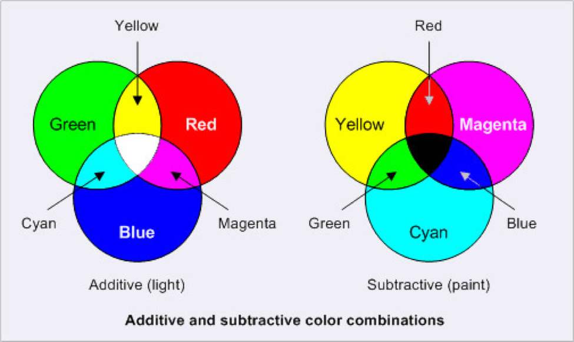
</center>

### HSV

HSV representa el color mediante:

- tono;
- saturación;
- valor o brillo.

Este espacio suele ser más intuitivo para seleccionar colores o segmentar regiones por tono.


### CMYK

CMYK se utiliza principalmente en impresión. Sus componentes son:

- cian;
- magenta;
- amarillo;
- negro.

A diferencia de RGB, CMYK es un modelo sustractivo, porque se basa en tintas que absorben luz.


---

## Canales

Una imagen RGB puede separarse en tres canales.

```text
Imagen RGB
    ↓
Canal R
Canal G
Canal B
```

Cada canal es una matriz de intensidades.

<center>
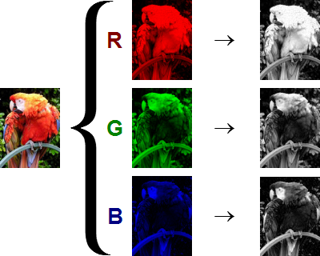
</center>


Esta idea es fundamental para visión por computador, porque una red neuronal no recibe una “imagen” en sentido visual. Recibe arreglos numéricos.

---

## Representación matricial de una imagen

Una imagen en escala de grises puede representarse como una matriz de dos dimensiones:

```text
(H, W)
```

donde:

- H es la altura;
- W es el ancho.

Una imagen RGB se representa como un arreglo de tres dimensiones:

```text
(H, W, C)
```

donde:

- H es la altura;
- W es el ancho;
- C es el número de canales.

Para una imagen RGB:

```text
C = 3
```

Por ejemplo:

```python
x.shape
```

podría devolver:

```text
(409, 640, 3)
```

Esto significa:

```text
409 píxeles de alto
640 píxeles de ancho
3 canales de color
```

---

## De imagen a tensor

En muchas bibliotecas de Python, como PIL o NumPy, las imágenes suelen representarse como:

```text
(H, W, C)
```

Sin embargo, en PyTorch las imágenes normalmente se representan como:

```text
(C, H, W)
```

Es decir, los canales aparecen primero.

```text
Imagen tradicional:
(H, W, C)

Tensor PyTorch:
(C, H, W)
```

Cuando se trabaja con varias imágenes al mismo tiempo, se agrega una nueva dimensión: el batch.

Entonces el tensor completo tiene forma:

```text
(N, C, H, W)
```

donde:

- N es el número de imágenes;
- C es el número de canales;
- H es la altura;
- W es el ancho.

Esta estructura es esencial para alimentar redes neuronales convolucionales.

---

## Carga de una imagen en Python

Podemos cargar una imagen con PIL:

```python
from PIL import Image
import numpy as np
import matplotlib.pyplot as plt

img = Image.open("imagenes/ejemplo.jpg")

x = np.asarray(img)

print(x.shape)
```

Si la imagen es RGB, probablemente obtendremos algo como:

```text
(H, W, 3)
```

Podemos visualizarla con:

```python
plt.imshow(x)
plt.axis("off")
plt.show()
```

---

## Separación de canales

Podemos obtener cada canal por separado:

```python
r = x[:, :, 0]
g = x[:, :, 1]
b = x[:, :, 2]
```

Y visualizarlos como imágenes en escala de grises:

```python
plt.imshow(r, cmap="gray")
plt.axis("off")
plt.show()
```

---

## Conversión a escala de grises

Una forma sencilla de convertir una imagen RGB a escala de grises es promediar sus canales:

```python
gris = x.mean(axis=2)
```

Luego se puede visualizar:

```python
plt.imshow(gris, cmap="gray", vmin=0, vmax=255)
plt.axis("off")
plt.show()
```

<center>
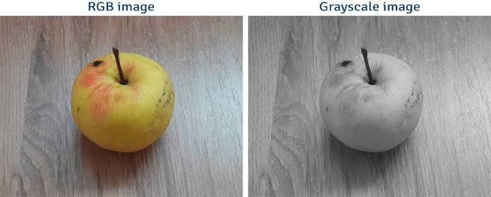
</center>


En aplicaciones reales se utilizan ponderaciones distintas para los canales, porque el ojo humano no percibe todos los colores con la misma sensibilidad.

---

## Normalización

Las imágenes cargadas desde archivos suelen tener valores enteros entre 0 y 255.

```text
0 ≤ x ≤ 255
```

Sin embargo, los modelos de aprendizaje profundo suelen trabajar mejor con valores en rangos más pequeños.

Una primera transformación habitual es llevar los valores al intervalo:

```text
0 ≤ x ≤ 1
```

Esto se logra dividiendo entre 255:

```python
x_norm = x / 255.0
```

---

## Normalización por media y desviación estándar

En modelos preentrenados, como muchos de los disponibles en TorchVision, no basta con transformar los valores a 0–1.

También se suele aplicar una normalización por canal:

```text
z = (x - μ) / σ
```

En el caso de modelos entrenados con ImageNet, se usan frecuentemente los valores:

```python
mean = [0.485, 0.456, 0.406]
std  = [0.229, 0.224, 0.225]
```

Esto significa que cada canal se normaliza con su propia media y desviación estándar.

```python
from torchvision import transforms

transform = transforms.Compose([
    transforms.Resize(256),
    transforms.CenterCrop(224),
    transforms.ToTensor(),
    transforms.Normalize(
        mean=[0.485, 0.456, 0.406],
        std=[0.229, 0.224, 0.225]
    )
])
```

Esta normalización es importante porque el modelo fue entrenado con imágenes transformadas de esa manera. Si se le entregan imágenes con otra escala numérica, su desempeño puede deteriorarse.

---

## Transformaciones geométricas y de preparación

Antes de ingresar una imagen a una red neuronal, suele ser necesario transformarla.

Algunas transformaciones comunes son:

```python
transforms.Resize(256)
transforms.CenterCrop(224)
transforms.ToTensor()
transforms.Normalize(mean, std)
```

Estas transformaciones permiten que todas las imágenes tengan una estructura compatible con el modelo.

Por ejemplo, muchos modelos preentrenados esperan imágenes RGB de tamaño aproximado:

```text
3 × 224 × 224
```


<center>
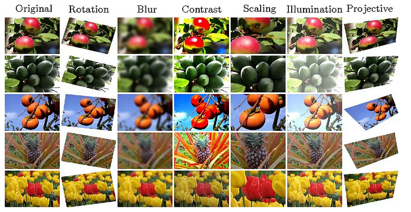
</center>


---

## Data augmentation

Además de preparar las imágenes, también podemos crear versiones modificadas de ellas durante el entrenamiento.

Esto se conoce como data augmentation.

Algunas transformaciones comunes son:

- rotaciones aleatorias;
- recortes aleatorios;
- cambios de brillo;
- cambios de contraste;
- volteo horizontal;
- cambios de perspectiva;
- conversión aleatoria a escala de grises.

Por ejemplo:

```python
transform_train = transforms.Compose([
    transforms.RandomResizedCrop(224),
    transforms.RandomHorizontalFlip(),
    transforms.ColorJitter(
        brightness=0.2,
        contrast=0.2,
        saturation=0.2
    ),
    transforms.ToTensor(),
    transforms.Normalize(mean, std)
])
```

La idea es aumentar la diversidad del conjunto de entrenamiento sin necesidad de recolectar nuevas imágenes.

---

## Tamaño en memoria

Una imagen no solo tiene tamaño visual. También ocupa memoria.

Por ejemplo, una imagen Full HD RGB de 8 bits tiene tamaño:

```text
1920 × 1080 × 3 bytes
```

Esto equivale aproximadamente a:

```text
6.2 MB
```

si se almacena sin compresión.

Si trabajamos con un batch de 32 imágenes:

```text
32 × 1920 × 1080 × 3
```

el consumo de memoria aumenta rápidamente.

Por esta razón, en aprendizaje profundo se utilizan tamaños de imagen controlados, batches limitados y hardware especializado como GPU.

---

## Compresión de imágenes

Los formatos de imagen no solo guardan píxeles. También pueden aplicar compresión.

### PNG

PNG utiliza compresión sin pérdida.

Esto significa que la imagen puede recuperarse exactamente después de descomprimirla.

Es útil para:

- diagramas;
- capturas de pantalla;
- imágenes con texto;
- transparencias;
- logos raster.

### JPEG

JPEG utiliza compresión con pérdida.

Esto significa que parte de la información original se elimina para reducir el tamaño del archivo.

Es útil para:

- fotografías;
- imágenes naturales;
- publicación web;
- almacenamiento eficiente.


<center>
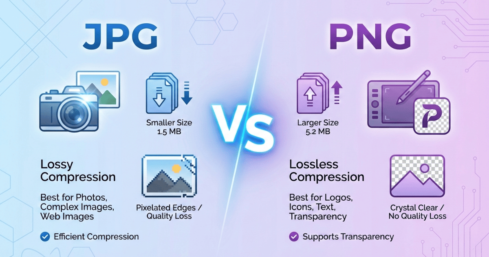
</center>

Una misma imagen puede ocupar tamaños muy diferentes dependiendo del formato y del nivel de compresión.

---

## Resumen

Una imagen digital es una representación numérica de una escena visual.

Para construirla se requieren varias decisiones:

```text
¿Raster o vector?
¿cuántos píxeles?
¿cuántos bits por píxel?
¿qué espacio de color?
¿qué formato de archivo?
¿qué normalización necesita el modelo?
```

En visión por computador, usualmente trabajamos con imágenes raster representadas como tensores.

```text
Imagen
    ↓
Matriz de píxeles
    ↓
Canales
    ↓
Tensor
    ↓
Modelo
```


Comprender esta transformación es esencial antes de estudiar redes convolucionales. Una CNN no observa imágenes como las observa una persona. Recibe tensores numéricos organizados espacialmente, y aprende filtros capaces de extraer patrones relevantes de esos datos.

# Preprocesamiento de imágenes

## Introducción

En el capítulo anterior estudiamos cómo una imagen digital puede representarse como una matriz de valores numéricos y posteriormente como un tensor. Sin embargo, una imagen obtenida directamente desde una cámara o almacenada en un archivo rara vez puede utilizarse inmediatamente para entrenar una red neuronal.

Los modelos de aprendizaje profundo esperan que todas las imágenes tengan una estructura homogénea. Deben tener las mismas dimensiones, el mismo número de canales y una escala de valores compatible con el proceso de entrenamiento utilizado para construir el modelo.

Por esta razón, antes de alimentar una imagen a una red neuronal se realiza un conjunto de operaciones denominado **preprocesamiento**.

En términos generales, el flujo de trabajo puede representarse como:

```text
Imagen
    ↓
Carga
    ↓
Transformaciones
    ↓
Tensor
    ↓
Normalización
    ↓
Modelo
```

Afortunadamente, PyTorch dispone de herramientas que automatizan prácticamente todo este proceso.

---

## Carga de imágenes con Pillow (PIL)

La biblioteca **Pillow**, conocida normalmente como **PIL**, es la librería estándar de Python para abrir y manipular imágenes.

```python
from PIL import Image

img = Image.open("imagenes/perro.jpg")
```

El objeto obtenido no es un arreglo de NumPy sino un objeto de tipo

```python
PIL.Image.Image
```

Podemos consultar algunas de sus propiedades.

```python
print(type(img))
print(img.size)
print(img.mode)
```

Por ejemplo

```
<class 'PIL.Image.Image'>

(640,480)

RGB
```

Aquí:

- `size` devuelve `(ancho, alto)`.
- `mode` indica el espacio de color utilizado.

Los modos más comunes son

|Modo|Descripción|
|----|-----------|
|L|Escala de grises|
|RGB|Rojo, Verde, Azul|
|RGBA|RGB con transparencia|
|CMYK|Impresión|

Una imagen puede visualizarse fácilmente mediante

```python
import matplotlib.pyplot as plt

plt.imshow(img)
plt.axis("off")
```

---

## Conversión a NumPy

Muchas operaciones numéricas requieren trabajar directamente sobre matrices.

```python
import numpy as np

x = np.asarray(img)

print(x.shape)
print(x.dtype)
```

Una salida típica es

```
(480,640,3)

uint8
```

Esto indica que la imagen tiene:

- 480 píxeles de alto.
- 640 píxeles de ancho.
- 3 canales.
- Cada valor ocupa un byte.

---

## ¿Por qué transformar las imágenes?

Supongamos que disponemos del siguiente conjunto de fotografías.

```
640×480

1024×768

350×200

512×512

4032×3024
```

Una red neuronal no puede recibir imágenes de tamaños arbitrarios.

Cada capa espera que la dimensión de la entrada sea fija.

Por esta razón, todas las imágenes deben convertirse a un formato común antes del entrenamiento.

En PyTorch esto se realiza mediante una secuencia de transformaciones.

---

## El módulo torchvision.transforms

PyTorch incorpora el módulo `torchvision.transforms`, encargado de preparar las imágenes antes de introducirlas en la red neuronal.

La filosofía consiste en construir un **pipeline** donde cada transformación recibe la salida de la transformación anterior.

```python
from torchvision import transforms

transform = transforms.Compose([
    ...
])
```

Cada vez que una imagen se procesa, las transformaciones se ejecutan en el orden indicado.

---

## Resize

La transformación más utilizada es **Resize**.

Permite modificar el tamaño de una imagen.

```python
transform = transforms.Resize((224,224))
```

o bien

```python
transform = transforms.Resize(256)
```

Cuando se proporciona un único número, PyTorch modifica la dimensión menor conservando la relación de aspecto.

Cuando se especifican dos números, la imagen se fuerza exactamente a ese tamaño.

```python
transforms.Resize((224,224))
```

es una operación muy utilizada porque numerosos modelos preentrenados esperan imágenes de aproximadamente

```
224×224
```

---

## ¿Por qué no entrenar con imágenes enormes?

Podría parecer que utilizar imágenes de mayor resolución siempre produce mejores resultados.

Sin embargo, esto tiene varios inconvenientes.

Una imagen cuatro veces más grande contiene aproximadamente cuatro veces más información, pero también requiere cuatro veces más memoria y un tiempo considerablemente mayor de procesamiento.

Además, muchas características relevantes ya pueden observarse en resoluciones moderadas.

Por esta razón es habitual reducir las imágenes antes del entrenamiento.

---

## Cropping

En muchas ocasiones la información importante se encuentra únicamente en una parte de la imagen.

El **cropping** consiste en extraer una región de interés.

PyTorch ofrece varias alternativas.

### Recorte centrado

```python
transforms.CenterCrop(224)
```

Extrae una región cuadrada alrededor del centro.

### Recorte aleatorio

```python
transforms.RandomCrop(224)
```

Selecciona una región distinta en cada ejecución.


El recorte aleatorio introduce una pequeña variabilidad durante el entrenamiento y ayuda a mejorar la capacidad de generalización del modelo.


<center>
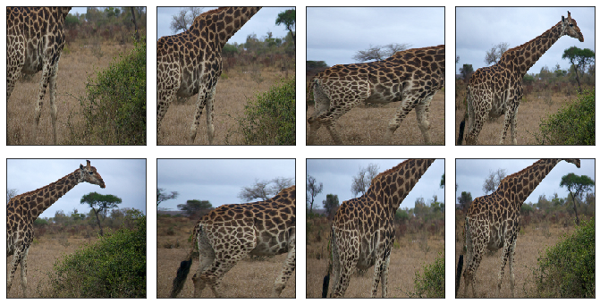
</center>
---

## Conversión a tensor

Las redes neuronales de PyTorch no trabajan con objetos PIL.

Trabajan con tensores.

```python
transforms.ToTensor()
```

Esta transformación realiza simultáneamente dos operaciones.

Primero reorganiza las dimensiones

```
(H,W,C)

↓

(C,H,W)
```

Segundo convierte automáticamente los valores

```
0 ... 255

↓

0 ... 1
```

obteniendo un tensor de tipo

```python
torch.float32
```

Esto evita tener que realizar la conversión manualmente.

---

## Normalización

Muchos modelos preentrenados esperan imágenes normalizadas.

La normalización se realiza por canal.

```python
transforms.Normalize(
    mean=[0.485,0.456,0.406],
    std=[0.229,0.224,0.225]
)
```

La operación aplicada es

\[
x'=\frac{x-\mu}{\sigma}
\]

para cada uno de los canales RGB.

Es importante comprender que estos valores no son arbitrarios.

Corresponden a la media y desviación estándar del conjunto **ImageNet**, utilizado para entrenar numerosos modelos disponibles en TorchVision.

Cuando se utiliza un modelo preentrenado, conviene aplicar exactamente la misma normalización utilizada durante su entrenamiento.

---

## Construcción completa del pipeline

Un pipeline típico puede escribirse como

```python
from torchvision import transforms

transform = transforms.Compose([

    transforms.Resize(256),

    transforms.CenterCrop(224),

    transforms.ToTensor(),

    transforms.Normalize(
        mean=[0.485,0.456,0.406],
        std=[0.229,0.224,0.225]
    )

])
```

Después basta con ejecutar

```python
x = transform(img)
```

para obtener un tensor listo para alimentar una red neuronal.

---

## Data augmentation

Hasta ahora todas las transformaciones buscaban preparar las imágenes.

Existe otro grupo de transformaciones cuyo objetivo no es preparar la imagen sino generar nuevas imágenes artificialmente.

Este proceso se denomina **data augmentation**.

La idea consiste en obtener muchas versiones diferentes de una misma fotografía.

Por ejemplo

- girarla;
- cambiar ligeramente el brillo;
- modificar el contraste;
- reflejarla horizontalmente;
- desplazarla algunos píxeles.

Aunque la fotografía cambie ligeramente, sigue representando el mismo objeto.

Esto aumenta el número efectivo de ejemplos disponibles para el entrenamiento.

---

### ¿Por qué funciona el data augmentation?

Supongamos que disponemos únicamente de veinte fotografías de un gato.

Una persona reconocería fácilmente un gato aunque estuviera ligeramente rotado o desplazado.

La red neuronal debería aprender la misma capacidad.

En lugar de conseguir cientos de fotografías adicionales, podemos generar automáticamente nuevas variantes de las imágenes existentes.

El modelo aprende entonces a reconocer el objeto independientemente de pequeñas modificaciones geométricas o fotométricas.


<center>
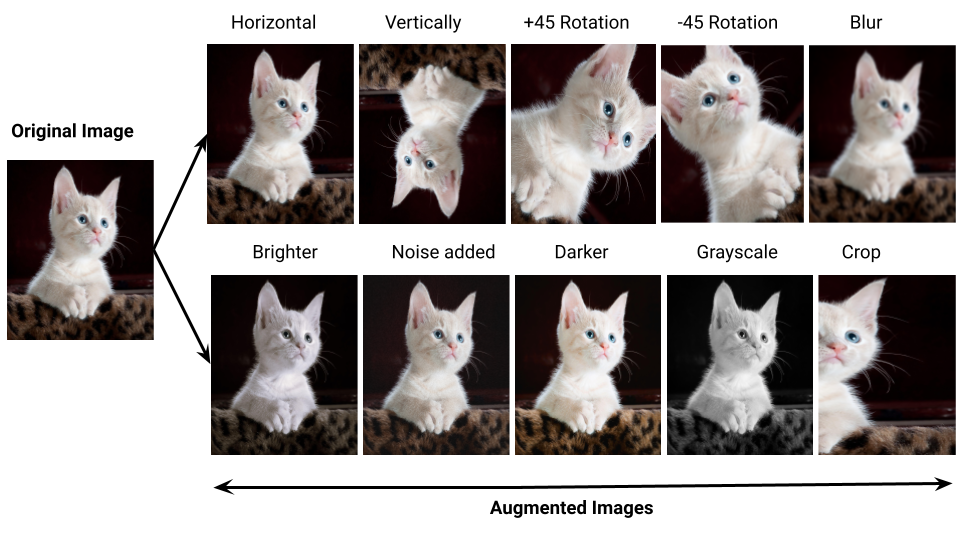
</center>

---

### Transformaciones geométricas

Las transformaciones geométricas modifican la posición o la forma de la imagen.

Entre las más utilizadas se encuentran

```python
RandomHorizontalFlip()

RandomRotation()

RandomCrop()

RandomAffine()

RandomPerspective()
```

Estas transformaciones cambian la geometría sin modificar la identidad del objeto.

---

### Transformaciones fotométricas

Las transformaciones fotométricas modifican la apariencia visual.

Por ejemplo

```python
ColorJitter(

    brightness=0.2,

    contrast=0.2,

    saturation=0.2,

    hue=0.05

)
```

También es posible convertir aleatoriamente algunas imágenes a escala de grises.

```python
RandomGrayscale(p=0.1)
```

Estas operaciones permiten entrenar modelos más robustos frente a cambios de iluminación.

---

## Un pipeline para entrenamiento

Durante el entrenamiento normalmente se utilizan transformaciones aleatorias.

```python
transform_train = transforms.Compose([

    transforms.Resize(256),

    transforms.RandomCrop(224),

    transforms.RandomHorizontalFlip(),

    transforms.ColorJitter(

        brightness=0.2,

        contrast=0.2,

        saturation=0.2

    ),

    transforms.ToTensor(),

    transforms.Normalize(

        mean=[0.485,0.456,0.406],

        std=[0.229,0.224,0.225]

    )

])
```

Cada vez que una imagen es cargada, se obtiene una versión ligeramente diferente.

---

## Transformaciones para evaluación

Durante la evaluación ya no deseamos introducir aleatoriedad.

Por ello normalmente se utiliza

```python
transform_test = transforms.Compose([

    transforms.Resize(256),

    transforms.CenterCrop(224),

    transforms.ToTensor(),

    transforms.Normalize(

        mean=[0.485,0.456,0.406],

        std=[0.229,0.224,0.225]

    )

])
```

Esto garantiza que todas las imágenes sean procesadas exactamente de la misma manera.

---

## El problema del desbalance de clases

Supongamos un conjunto de entrenamiento formado por

```
Perros : 8000 imágenes

Gatos : 1200 imágenes

Caballos : 600 imágenes
```

Si entrenamos directamente con estos datos, la red aprenderá mucho mejor la clase "Perro", simplemente porque aparece con mucha mayor frecuencia.

Este problema recibe el nombre de **desbalance de clases**.

No siempre puede solucionarse recolectando nuevas imágenes.

---

### Estrategias para balancear el entrenamiento

Existen varias estrategias.

#### Aumentar la clase minoritaria

Puede utilizarse data augmentation únicamente sobre las clases menos representadas.

Esto incrementa artificialmente el número de ejemplos disponibles.

#### Reducir la clase mayoritaria

Otra posibilidad consiste en utilizar únicamente una parte de las imágenes pertenecientes a la clase dominante.

#### Muestreo balanceado

PyTorch permite construir cargadores de datos que seleccionan ejemplos de manera aproximadamente uniforme entre las distintas clases.

#### Funciones de pérdida ponderadas

También puede modificarse la función de pérdida asignando un mayor peso a las clases poco frecuentes.

---

## Resumen

El preprocesamiento constituye una etapa fundamental en cualquier sistema de visión por computador.

Antes de que una imagen llegue a una red neuronal normalmente pasa por varias etapas:

```text
Carga (PIL)
      ↓
Resize
      ↓
Crop
      ↓
ToTensor
      ↓
Normalize
      ↓
Data augmentation (solo entrenamiento)
      ↓
Modelo
```

El éxito de un modelo no depende únicamente de la arquitectura utilizada. La calidad y consistencia del proceso de preprocesamiento suelen tener un impacto tan importante como el propio modelo de aprendizaje profundo.

Mira estos dos libros de preprocesamiento de imágenes: 
* [Transformación de imágenes: ](./carga_tranformaciones.ipynb)
* [Data augmentation](./Data_Augmentation.ipynb)

# Redes convolucionales

Hasta este punto hemos aprendido a representar una imagen como un tensor y a prepararla para ser utilizada por un modelo de aprendizaje profundo. Sin embargo, aún no hemos respondido una pregunta fundamental:

> **¿Cómo puede un computador comprender el contenido de una imagen?**

Para una persona resulta sencillo reconocer un automóvil, un perro o una letra escrita a mano. No analizamos cada píxel de manera individual; nuestro cerebro identifica patrones como bordes, curvas, esquinas, texturas y formas, y posteriormente combina esas características para reconocer el objeto completo.

Las redes neuronales convolucionales, conocidas como **Convolutional Neural Networks (CNN)**, buscan reproducir esta idea. En lugar de trabajar directamente con todos los píxeles de la imagen, extraen progresivamente características cada vez más complejas.

Las primeras capas suelen detectar elementos muy simples, como bordes horizontales o verticales. Las capas intermedias combinan estos bordes para formar curvas, esquinas y texturas. Finalmente, las últimas capas son capaces de reconocer partes completas de los objetos y utilizarlas para realizar una clasificación.

Este proceso de extracción automática de características constituye una de las principales razones del éxito de las CNN en problemas de visión por computador.

---

## Convolución

La operación fundamental de una red convolucional es la **convolución**.

La idea es sorprendentemente sencilla. En lugar de analizar toda la imagen simultáneamente, se toma una pequeña ventana, denominada **filtro**, y se desplaza sobre toda la imagen realizando siempre el mismo cálculo.

```text
Imagen
+-----------------------+
|                       |
|   +-----+             |
|   |#####|             |
|   |#####|  ← filtro   |
|   |#####|             |
|   +-----+             |
|                       |
+-----------------------+

El filtro se desplaza por toda la imagen.
```
<center>
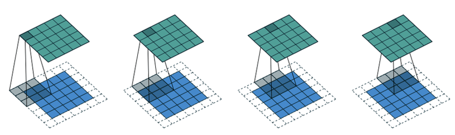
</center>

El desplazamiento permite aplicar una operación de producto y suma que regresa una nueva imagen que corresponde a una imagen filtrada

<center>
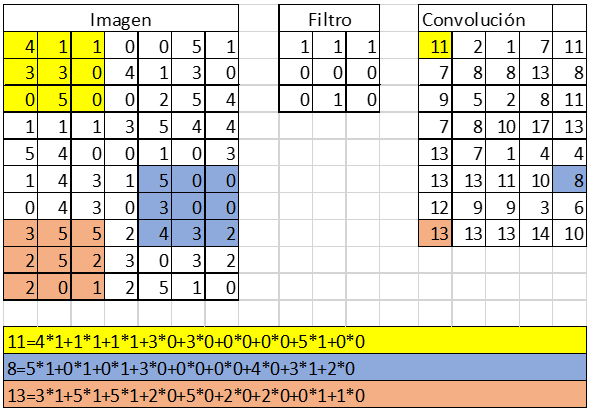
</center>


En cada posición, el filtro compara el patrón contenido en la imagen con el patrón que representa el propio filtro.

Cuando ambos patrones son similares, la respuesta obtenida es alta.

Cuando son diferentes, la respuesta es pequeña.

De esta manera, el filtro actúa como un detector de una determinada característica visual.

La gran ventaja de este procedimiento es que **el mismo filtro se utiliza sobre toda la imagen**. No importa dónde aparezca un borde o una textura; el filtro será capaz de detectarlo en cualquier posición.

Esto hace que las CNN necesiten muchos menos parámetros que una red neuronal completamente conectada.

<center>
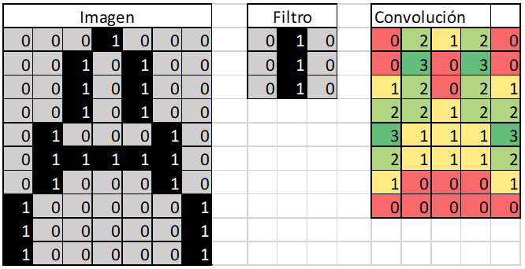
</center>
<center>
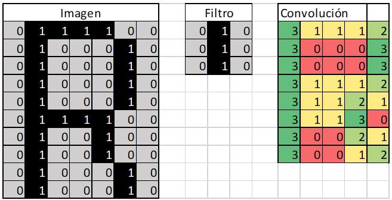
</center>
---

## Filtros

Un filtro puede entenderse como una pequeña matriz de coeficientes.

Por ejemplo, un filtro de tamaño

```text
3 × 3
```

podría representarse como

```text
-1  0  1
-1  0  1
-1  0  1
```

Este filtro responde principalmente ante bordes verticales.

Otro filtro diferente podría responder ante bordes horizontales.

```text
-1 -1 -1
 0  0  0
 1  1  1
```

Incluso pueden diseñarse filtros que detecten diagonales, esquinas o determinadas texturas.

Sin embargo, en una red convolucional moderna estos filtros **no son diseñados manualmente**.

Durante el entrenamiento, la propia red neuronal aprende cuáles filtros producen mejores resultados para resolver el problema propuesto.

En otras palabras, la red aprende automáticamente qué patrones son relevantes para distinguir las diferentes clases.

Cada filtro puede especializarse en detectar una característica distinta.

Algunos reaccionarán ante bordes.

Otros responderán a texturas.

Otros detectarán regiones con determinados colores.

Y otros terminarán reaccionando ante patrones mucho más complejos, como ojos, ruedas, ventanas o letras.

---

## Pooling

Después de una o varias convoluciones, la imagen suele contener una gran cantidad de información.

No toda esa información resulta igualmente importante.

Por esta razón, las CNN incorporan una etapa denominada **pooling**, cuyo objetivo consiste en reducir la cantidad de datos manteniendo únicamente la información más representativa.

La operación más utilizada es el **Max Pooling**.

Supongamos la siguiente región de una imagen de características.

```text
2   4
7   5
```

Un Max Pooling de tamaño

```text
2 × 2
```

produce

```text
7
```

porque únicamente conserva el valor máximo de la región.

La operación se repite sobre toda la imagen.

Como consecuencia, la resolución espacial disminuye.

Sin embargo, las características más importantes permanecen presentes.

Este proceso presenta varias ventajas.

- Reduce el tamaño de la información que debe procesarse.
- Disminuye el consumo de memoria.
- Reduce el número de operaciones necesarias.
- Hace que la detección sea menos sensible a pequeños desplazamientos del objeto dentro de la imagen.

En cierto sentido, el pooling realiza una forma de resumen de las características detectadas.

---

## Feature Maps

Cada filtro aplicado mediante convolución produce una nueva imagen.

Esta imagen no representa colores ni intensidades originales.

Representa la respuesta del filtro sobre toda la imagen.

Estas nuevas imágenes reciben el nombre de **feature maps** o **mapas de características**.

Si una capa convolucional utiliza

```text
64 filtros
```

entonces producirá

```text
64 feature maps.
```

Cada uno de ellos resalta una característica distinta de la imagen.

Podemos imaginar el proceso de la siguiente forma.

```text
Imagen original
        │
        ▼
  ┌──────────────┐
  │ Convolución  │
  └──────────────┘
        │
        ▼
 ┌───────────────────────┐
 │ Feature Map 1         │
 │ Feature Map 2         │
 │ Feature Map 3         │
 │ ...                   │
 │ Feature Map 64        │
 └───────────────────────┘
        │
        ▼
      Pooling
        │
        ▼
 Nuevos feature maps
```

Los primeros feature maps suelen responder a características muy simples, como líneas o bordes.

A medida que la información atraviesa nuevas capas convolucionales, estos mapas comienzan a combinarse entre sí.

De esta manera aparecen detectores de estructuras cada vez más complejas.

Unas pocas capas después, la red puede reconocer partes completas de un objeto.

Finalmente, las últimas capas utilizan todas estas características para realizar la clasificación.

Este proceso explica por qué las redes convolucionales resultan tan eficientes. En lugar de memorizar imágenes completas, aprenden una jerarquía de características, comenzando por patrones muy simples y construyendo progresivamente representaciones cada vez más abstractas de la información visual.


<center>
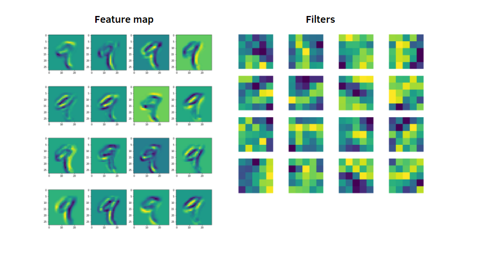
</center>

Miremos este libro para entender el proceso de la convolución:
[Entendamos la convolución](./entendiendo_la_convolucion_pytorch.ipynb)

## Arquitectura de una CNN

En el capítulo anterior comprendimos el principio fundamental de las redes convolucionales: utilizar filtros que se desplazan sobre la imagen para detectar automáticamente patrones visuales.

Sin embargo, una capa convolucional no queda completamente definida indicando únicamente que realiza una convolución. Existen varios parámetros que determinan cómo se aplica el filtro sobre la imagen y cuál será el tamaño de la salida obtenida.

Los parámetros más importantes son:

- tamaño del kernel;
- padding;
- stride;
- número de filtros.

Comprender estos conceptos resulta esencial para diseñar arquitecturas convolucionales y para interpretar correctamente las dimensiones de los tensores que circulan por la red.

---

### Tamaño del kernel

El **kernel**, también llamado **filtro convolucional**, es la pequeña matriz que se desplaza sobre la imagen.

Los tamaños más comunes son

```text
3×3

5×5

7×7
```

Aunque matemáticamente cualquier tamaño es posible, en la práctica las arquitecturas modernas utilizan principalmente filtros de

```text
3×3
```

Esto se debe a varias razones.

Un filtro pequeño requiere pocos parámetros y, al combinar varias capas consecutivas, puede capturar información equivalente a filtros mucho más grandes, pero con menor costo computacional y mayor capacidad de aprendizaje.

Por ejemplo, una secuencia de tres convoluciones de tamaño

```text
3×3
```

permite que cada neurona tenga un campo receptivo mucho mayor que una única convolución.

Además, entre cada convolución se introducen funciones de activación, aumentando la capacidad de representación del modelo.

Por esta razón, arquitecturas como VGG demostraron que utilizar muchos filtros pequeños suele ser más eficiente que utilizar pocos filtros grandes.

---

### Padding

Cuando un filtro se aplica sobre una imagen, no puede situarse completamente sobre los bordes.

Como consecuencia, la salida suele ser más pequeña que la imagen original.

Por ejemplo, una imagen

```text
7 × 7
```

procesada con un filtro

```text
3 × 3
```

produce una salida de

```text
5 × 5
```

si no se realiza ninguna operación adicional.

Esto ocurre porque el filtro necesita disponer de vecinos alrededor del píxel central.

```text
Imagen

#########
#########
#########

↓

Convolución

#######
#######
#######
```

Para evitar esta reducción puede añadirse un borde artificial alrededor de la imagen.

Este procedimiento recibe el nombre de **padding**.

Normalmente ese borde se rellena con ceros.

```text
000000000
011111110
011111110
011111110
000000000
```

El filtro puede entonces desplazarse también sobre los extremos de la imagen.

La ventaja principal es que el tamaño espacial puede conservarse.

Por ejemplo, utilizando

```text
Kernel = 3

Padding = 1
```

una imagen

```text
224 × 224
```

produce nuevamente una salida

```text
224 × 224
```

Por esta razón, el padding aparece con mucha frecuencia en las arquitecturas modernas.

---

### Stride

El **stride** determina cuánto avanza el filtro entre dos posiciones consecutivas.

Cuando

```text
Stride = 1
```

el filtro avanza un píxel cada vez.

```text
#########

 ↑
```

↓

```text
#########

  ↑
```

↓

```text
#########

   ↑
```

Cuando

```text
Stride = 2
```

el desplazamiento es de dos píxeles.

```text
#########

 ↑
```

↓

```text
#########

   ↑
```

Como consecuencia, la salida contiene menos posiciones.

Un stride mayor produce dos efectos importantes.

- Disminuye el tamaño de la salida.
- Reduce el número de operaciones necesarias.

Por ello, aumentar el stride constituye otra forma de reducir progresivamente la resolución espacial de las características.

---

### Número de filtros

Hasta ahora hemos supuesto que únicamente existe un filtro.

Sin embargo, una capa convolucional suele utilizar decenas o incluso cientos de filtros simultáneamente.

Por ejemplo,

```python
torch.nn.Conv2d(
    in_channels=3,
    out_channels=64,
    kernel_size=3
)
```

significa que la capa aprenderá

```text
64 filtros diferentes.
```

Cada uno de ellos intentará detectar una característica distinta.

Por ello, la salida no será una única imagen.

Será un conjunto de

```text
64 feature maps.
```

En consecuencia, el número de canales de salida coincide exactamente con el número de filtros utilizados.

---

### Dimensión de salida

El tamaño de salida de una convolución depende de cuatro parámetros.

- Tamaño de la entrada.
- Tamaño del kernel.
- Padding.
- Stride.

Si la dimensión de entrada es

\[
N
\]

el kernel tiene tamaño

\[
K
\]

el padding es

\[
P
\]

y el stride vale

\[
S,
\]

la dimensión espacial de salida viene dada por

$$
N_{out}
=
\left\lfloor
\frac{N-K+2P}{S}
\right\rfloor
+1.
$$

Esta expresión se aplica tanto al ancho como a la altura.

Por ejemplo, supongamos

```text
Entrada : 224

Kernel : 3

Padding : 1

Stride : 1
```

Entonces

\[
\frac{224-3+2}{1}+1=224.
\]

Es decir,

```text
224 × 224

↓

224 × 224
```

Si cambiamos únicamente

```text
Stride = 2
```

obtenemos

$$
\frac{224-3+2}{2}+1
=
112.
$$

Ahora la salida será

```text
112 × 112.
```

Este cálculo permite diseñar arquitecturas completas sin necesidad de ejecutar el modelo.

---

### Cálculo del número de parámetros

Una de las ventajas fundamentales de las CNN consiste en utilizar muchos menos parámetros que una red totalmente conectada.

Supongamos una imagen RGB.

Cada filtro de tamaño

```text
3 × 3
```

debe operar sobre los tres canales.

Por tanto, el filtro contiene

```text
3 × 3 × 3 = 27
```

pesos.

Adicionalmente existe un sesgo (*bias*).

Cada filtro tiene entonces

```text
28 parámetros.
```

Si la capa utiliza

```text
64 filtros
```

el número total de parámetros será

```text
64 × (27 + 1)

=
1792
```

Obsérvese que este número **no depende del tamaño de la imagen**.

Una imagen de

```text
224 × 224
```

y otra de

```text
1024 × 1024
```

utilizan exactamente los mismos filtros.

Esta reutilización de parámetros constituye una de las principales razones por las cuales las CNN pueden entrenarse con imágenes de gran tamaño.

En general, el número de parámetros de una capa convolucional viene dado por

\[
(K_h K_w C_{in}+1)C_{out}
\]

donde

- \(K_h\) y \(K_w\) representan el tamaño del kernel.
- \(C_{in}\) es el número de canales de entrada.
- \(C_{out}\) es el número de filtros o canales de salida.

---

### Ejemplo completo de Conv2D en PyTorch

La implementación de una capa convolucional en PyTorch resulta muy sencilla.

```python
import torch
import torch.nn as nn

conv = nn.Conv2d(
    in_channels=3,
    out_channels=64,
    kernel_size=3,
    stride=1,
    padding=1
)
```

Esta capa espera imágenes RGB.

El tamaño de entrada será

```text
(N,3,H,W)
```

y la salida tendrá dimensiones

```text
(N,64,H,W)
```

si el padding y el stride conservan la resolución.

Podemos comprobarlo fácilmente.

```python
x = torch.randn(8,3,224,224)
y = conv(x)
print(x.shape)
print(y.shape)
```

La salida es

```text
torch.Size([8,3,224,224])
torch.Size([8,64,224,224])
```

Obsérvese que únicamente cambia el número de canales.

Los filtros han generado sesenta y cuatro mapas de características distintos para cada imagen del lote.

---

### Resumen

Una capa convolucional queda completamente definida mediante cuatro parámetros principales.

- El **kernel** determina el tamaño del patrón que se desea detectar.
- El **padding** controla el tratamiento de los bordes y permite conservar la resolución espacial.
- El **stride** define cuánto se desplaza el filtro y controla la reducción del tamaño de la salida.
- El **número de filtros** determina cuántos mapas de características producirá la capa.

El comportamiento conjunto de estos parámetros define la estructura de cualquier red convolucional moderna.

Comprender cómo modifican las dimensiones del tensor y el número de parámetros resulta indispensable para diseñar arquitecturas profundas y para interpretar correctamente los modelos disponibles en bibliotecas como TorchVision.


Miremos un ejemplo de una red convolucional acá
[Ejemplo convolucional vs denso](./modelo_convolucional_vs_denso.ipynb)


## Clasificación visual

Una vez que una red convolucional ha extraído las características más relevantes de una imagen, el siguiente paso consiste en tomar una decisión.

En el problema más sencillo de visión por computador, denominado **clasificación visual**, se supone que cada imagen pertenece únicamente a una clase.

Por ejemplo, una imagen puede representar:

- un perro;
- un gato;
- un automóvil;
- una bicicleta;
- una flor.

El objetivo consiste en asignar una única etiqueta a cada imagen.

```text
Imagen
      ↓
CNN
      ↓
Extracción de características
      ↓
Clasificador
      ↓
Clase
```

Esta tarea constituye uno de los problemas fundamentales del aprendizaje profundo y ha servido como punto de partida para el desarrollo de arquitecturas mucho más complejas, como la detección y segmentación de objetos.

---

### CNN para clasificación

Una red convolucional destinada a clasificación puede entenderse como dos grandes bloques funcionales.

El primero corresponde a la **extracción de características**.

Está compuesto por varias capas convolucionales, funciones de activación y operaciones de pooling.

Su objetivo consiste en transformar la imagen original en una representación mucho más compacta que conserve únicamente la información relevante.

```text
Imagen
      ↓
Convoluciones
      ↓
Feature Maps
      ↓
Pooling
      ↓
Representación de características
```

El segundo bloque corresponde al **clasificador**.

Una vez obtenidas las características, estas se reorganizan en un único vector y se introducen en una o varias capas completamente conectadas (*Fully Connected Layers*).

Finalmente, la última capa contiene una neurona por cada clase del problema.

Por ejemplo, si deseamos distinguir entre diez clases diferentes, la última capa tendrá diez salidas.

```text
Características
        ↓
Flatten
        ↓
Capas densas
        ↓
10 neuronas
        ↓
Probabilidades
```

La salida del modelo no suele ser directamente una clase, sino un conjunto de puntuaciones (*scores*) para todas las clases posibles.

Estas puntuaciones se transforman habitualmente mediante una función **Softmax**, obteniendo una distribución de probabilidades.

Por ejemplo

| Clase | Probabilidad |
|--------|-------------:|
| Gato | 0.02 |
| Perro | 0.93 |
| Caballo | 0.03 |
| Vaca | 0.01 |
| Oveja | 0.01 |

La decisión final consiste simplemente en seleccionar la clase con mayor probabilidad.

En este ejemplo, la imagen sería clasificada como un perro.

Es importante observar que la red neuronal no compara la imagen con ejemplos almacenados previamente. Lo que realmente hace es transformar la imagen en un conjunto de características y, a partir de ellas, estimar la probabilidad de pertenecer a cada clase.

---

### Métricas

Una vez entrenado un modelo, es necesario evaluar su desempeño.

La métrica más sencilla es la **exactitud** (*Accuracy*).

La exactitud representa la proporción de imágenes correctamente clasificadas respecto al total de imágenes evaluadas.

\[
Accuracy =
\frac{\text{Número de aciertos}}
{\text{Número total de imágenes}}
\]

Por ejemplo, si un modelo clasifica correctamente 920 imágenes de un conjunto de 1000, su exactitud será

\[
Accuracy = 0.92.
\]

Aunque esta métrica resulta muy intuitiva, no siempre describe correctamente el comportamiento del modelo.

Supongamos un conjunto de imágenes formado por

- 950 perros.
- 50 gatos.

Si el modelo clasifica absolutamente todas las imágenes como perros, obtendrá una exactitud del

\[
95\%.
\]

Sin embargo, nunca habrá reconocido correctamente un solo gato.

Este ejemplo muestra que una alta exactitud no garantiza necesariamente un buen modelo.

Por esta razón, en muchos problemas se utilizan métricas adicionales.

Entre las más importantes se encuentran:

- Precisión (*Precision*).
- Sensibilidad (*Recall*).
- Medida F1 (*F1-score*).

Estas métricas permiten analizar con mayor detalle los distintos tipos de errores cometidos por el clasificador.

En capítulos posteriores estudiaremos estas medidas con mayor profundidad cuando abordemos problemas de clasificación binaria y detección de objetos.

---

### Matriz de confusión

La herramienta más útil para comprender el comportamiento de un clasificador es la **matriz de confusión**.

La matriz de confusión compara las clases reales con las clases predichas por el modelo.

Cada fila representa la clase verdadera.

Cada columna representa la clase predicha.

Por ejemplo, para tres clases distintas, la matriz puede tomar la forma

|Clase real \\ Clase predicha|Perro|Gato|Caballo|
|---|---:|---:|---:|
|Perro|94|4|2|
|Gato|3|88|9|
|Caballo|1|6|93|

Los elementos de la diagonal principal corresponden a las clasificaciones correctas.

Los valores fuera de la diagonal representan errores de clasificación.

Por ejemplo, la tabla anterior indica que:

- cuatro perros fueron clasificados como gatos;
- nueve gatos fueron clasificados como caballos;
- seis caballos fueron clasificados como gatos.

La matriz de confusión permite identificar rápidamente qué clases presentan mayor dificultad para el modelo.

Además, constituye el punto de partida para calcular métricas como la precisión, la sensibilidad y la medida F1.

En problemas con pocas clases, la matriz de confusión proporciona una visión mucho más completa que una única cifra de exactitud.

---

### Interpretación de los errores

Una de las ventajas de las redes neuronales modernas es que permiten obtener modelos con una elevada capacidad de clasificación.

Sin embargo, ningún modelo es perfecto.

Analizar únicamente el porcentaje de aciertos puede ocultar información importante.

La inspección de las imágenes clasificadas incorrectamente suele revelar aspectos como:

- clases muy similares entre sí;
- imágenes mal etiquetadas;
- ejemplos con poca iluminación;
- objetos parcialmente ocultos;
- imágenes de baja resolución;
- diferencias entre el conjunto de entrenamiento y el conjunto de prueba.

En muchas ocasiones, mejorar el conjunto de datos produce una mayor mejora del desempeño que modificar la arquitectura de la red neuronal.

Por esta razón, el análisis de errores constituye una etapa fundamental del desarrollo de cualquier sistema de visión por computador.

---

### Resumen

El objetivo de un sistema de clasificación visual consiste en asignar una única etiqueta a cada imagen.

Las redes convolucionales realizan esta tarea en dos etapas.

Primero extraen automáticamente características mediante convoluciones y operaciones de pooling.

Posteriormente utilizan estas características para estimar la probabilidad de pertenencia a cada una de las clases posibles.

El desempeño del modelo puede evaluarse mediante diferentes métricas, siendo la exactitud la más sencilla.

No obstante, la matriz de confusión proporciona una visión mucho más completa del comportamiento del clasificador y permite comprender en qué clases se producen los principales errores.


## Evolución de las arquitecturas convolucionales

Una vez comprendido el funcionamiento general de una red convolucional, surge una pregunta natural:

> **¿Existe una única arquitectura de CNN?**

La respuesta es no.

Desde finales de los años noventa se han desarrollado numerosas arquitecturas, cada una buscando resolver limitaciones encontradas en las generaciones anteriores.

Curiosamente, muchas de las ideas que hoy parecen naturales surgieron como respuesta a problemas concretos encontrados durante el entrenamiento de redes cada vez más profundas.

En esta sección revisaremos las arquitecturas más representativas y las ideas que aportaron al desarrollo de la visión por computador.

<center>
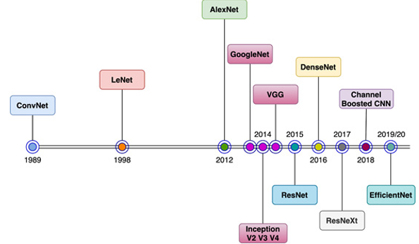
</center>

---

### LeNet (1998)

La primera arquitectura convolucional ampliamente reconocida fue **LeNet-5**, desarrollada por Yann LeCun y colaboradores en 1998.

Su objetivo era reconocer automáticamente dígitos escritos a mano utilizados en cheques bancarios y códigos postales.

LeNet demostró que era posible aprender automáticamente filtros convolucionales a partir de los datos, evitando diseñar manualmente detectores de bordes o texturas.

La arquitectura estaba compuesta por una secuencia de

- convoluciones;
- funciones de activación;
- capas de pooling;
- capas completamente conectadas.

Aunque hoy parece una red muy pequeña, LeNet marcó el nacimiento práctico de las redes convolucionales.

Sus principales aportes fueron:

- demostrar la utilidad de las convoluciones;
- introducir el aprendizaje automático de filtros;
- establecer la estructura básica de extracción de características seguida de un clasificador.

<center>
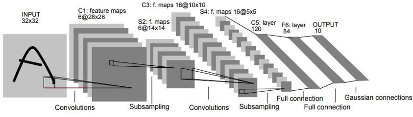
</center>

[Libro de trabajo o ejemplo con Lenet](./lenet.ipynb)

---

### AlexNet (2012)

Durante muchos años las CNN tuvieron poco impacto debido a la limitada capacidad computacional disponible.

En 2012, Alex Krizhevsky presentó **AlexNet**, logrando una mejora espectacular en la competencia ImageNet Large Scale Visual Recognition Challenge (ILSVRC).

AlexNet incorporó varias ideas importantes.

- Redes considerablemente más profundas.
- Utilización masiva de GPU para entrenamiento.
- Funciones de activación ReLU.
- Dropout para reducir sobreajuste.
- Data augmentation durante el entrenamiento.

AlexNet demostró definitivamente que el aprendizaje profundo podía superar ampliamente los métodos clásicos de visión por computador.

Su éxito marcó el inicio de la revolución moderna del Deep Learning.

<center>
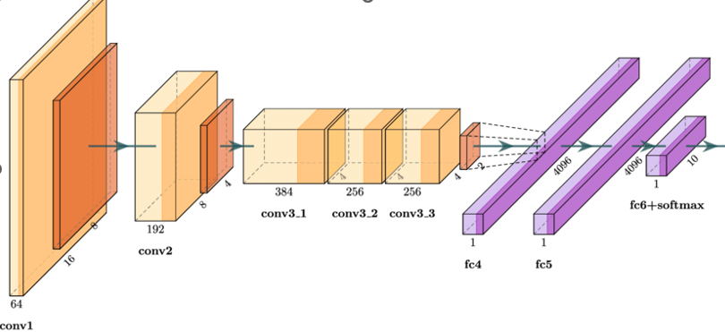
</center>

[Libro de trabajo o ejemplo con AlexNet](./alexnet.ipynb)

---

### VGG (2014)

Una pregunta natural era:

> **¿Es mejor utilizar filtros grandes o muchos filtros pequeños?**

La arquitectura **VGG**, desarrollada por el Visual Geometry Group de la Universidad de Oxford, respondió esta pregunta proponiendo utilizar únicamente filtros

```text
3 × 3
```

repetidos muchas veces.

Aunque la red se hizo considerablemente más profunda, el número de parámetros permanecía razonablemente controlado.

Las ventajas fueron varias.

- Arquitectura extremadamente simple.
- Excelente capacidad de representación.
- Fácil de implementar.
- Muy utilizada como modelo base para transferencia de aprendizaje.

Incluso hoy continúa siendo una de las arquitecturas más utilizadas con fines educativos.

<center>
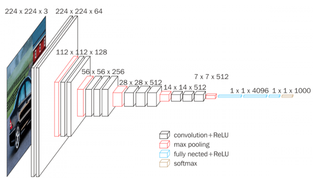
</center>

[Libro de trabajo o ejemplo con VGG](./vgg.ipynb)

---

### GoogLeNet e Inception (2014)

Hasta este momento todas las capas utilizaban un tamaño fijo de filtro.

Sin embargo, diferentes objetos pueden presentar características relevantes a distintas escalas.

Una textura fina requiere filtros pequeños.

Un objeto grande puede necesitar filtros considerablemente mayores.

La arquitectura **GoogLeNet** introdujo el concepto de **Inception Module**.

En lugar de decidir un único tamaño de filtro, la red aplica simultáneamente convoluciones de diferentes tamaños.

Por ejemplo

```text
1×1

3×3

5×5
```

Todas ellas trabajan en paralelo y sus resultados se combinan posteriormente.

Esta idea permitió que la propia red aprendiera automáticamente cuál escala resultaba más apropiada para cada característica.

Además, las convoluciones

```text
1×1
```

permitieron reducir significativamente la cantidad de parámetros antes de aplicar filtros mayores.

Los módulos Inception marcaron un cambio importante en el diseño de arquitecturas profundas.


<center>
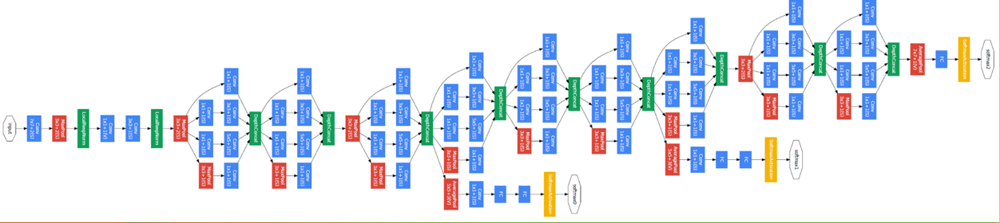
</center>

[Libro de trabajo o ejemplo con Google Inception](./google_inception.ipynb)

---

### ResNet (2015)

A medida que las redes crecían aparecía un nuevo problema.

Agregar más capas no siempre mejoraba el desempeño.

Por el contrario, las redes muy profundas comenzaban a degradarse durante el entrenamiento debido al problema del desvanecimiento del gradiente.

La arquitectura **Residual Network (ResNet)** introdujo una idea extremadamente sencilla pero revolucionaria.

En lugar de obligar a cada bloque de la red a aprender completamente una transformación, la red aprende únicamente la diferencia respecto a la entrada.

Para lograrlo se incorporan conexiones directas conocidas como **skip connections** o **residual connections**.

Estas conexiones permiten que la información y el gradiente atraviesen muchas capas sin degradarse.

Gracias a esta idea fue posible entrenar redes con

- 50 capas;
- 101 capas;
- 152 capas;
- incluso cientos de capas adicionales.

Actualmente ResNet constituye uno de los modelos de referencia más importantes en visión por computador.

Muchas arquitecturas posteriores derivan directamente de este concepto.

<center>
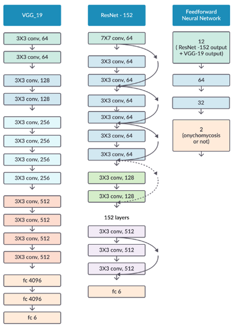
</center>

[Libro de trabajo o ejemplo conResNet](./resnet.ipynb)

---


---

## Comparación de arquitecturas

Cada arquitectura introdujo una idea nueva.

|Modelo|Aporte principal|
|---|---|
|LeNet|Nacimiento de las CNN modernas|
|AlexNet|Uso masivo de GPU, ReLU y Deep Learning|
|VGG|Filtros pequeños repetidos|
|GoogLeNet / Inception|Filtros de múltiples escalas|
|ResNet|Conexiones residuales para redes muy profundas|

Obsérvese que ninguna arquitectura reemplaza completamente a la anterior.

Cada una incorpora una nueva idea que posteriormente es reutilizada por modelos más modernos.

---

## TorchVision y los modelos preentrenados

Entrenar una red convolucional desde cero requiere enormes cantidades de imágenes, tiempos prolongados de entrenamiento y una capacidad computacional considerable.

Afortunadamente, PyTorch proporciona la biblioteca **TorchVision**, que incluye numerosos modelos previamente entrenados sobre conjuntos de datos de gran tamaño.

La carga de un modelo es muy sencilla.

```python
from torchvision import models

model = models.resnet50(weights="DEFAULT")
```

Del mismo modo pueden cargarse otras arquitecturas.

```python
models.alexnet()

models.googlenet()

models.vgg16()

models.resnet18()

models.resnet50()

models.inception_v3()
```

Los pesos descargados corresponden normalmente a modelos entrenados sobre **ImageNet**, uno de los conjuntos de datos más importantes de visión por computador.

Estos modelos constituyen el punto de partida para la mayoría de aplicaciones modernas mediante **Transfer Learning**.

---

## Los conjuntos de datos de TorchVision

Además de modelos preentrenados, TorchVision incorpora numerosos conjuntos de datos listos para utilizar.

Entre los más conocidos se encuentran:

### Clasificación de imágenes

- MNIST
- FashionMNIST
- KMNIST
- CIFAR10
- CIFAR100
- Caltech101
- Caltech256
- Stanford Cars
- Food101
- ImageNet
- EuroSAT
- CelebA

Cada conjunto de datos presenta un problema diferente.

Por ejemplo:

- **MNIST** contiene dígitos escritos a mano.
- **FashionMNIST** reemplaza los dígitos por prendas de vestir.
- **CIFAR-10** contiene diez categorías de objetos cotidianos.
- **Caltech101** incorpora más de cien categorías diferentes.
- **ImageNet** contiene más de un millón de imágenes distribuidas en mil clases.

La carga de estos conjuntos de datos es igualmente sencilla.

```python
from torchvision.datasets import CIFAR10

dataset = CIFAR10(
    root="./datos",
    train=True,
    download=True
)
```

Esto permite concentrarse en el diseño del modelo sin preocuparse por descargar y organizar manualmente miles de imágenes.

---

## Hacia el aprendizaje por transferencia

La disponibilidad de modelos preentrenados ha cambiado profundamente la forma de desarrollar sistemas de visión por computador.

En lugar de entrenar una red completamente desde cero, hoy resulta mucho más habitual reutilizar un modelo previamente entrenado y adaptarlo a un nuevo problema.

Este procedimiento recibe el nombre de **Transfer Learning** y constituye una de las técnicas más utilizadas en aplicaciones reales de aprendizaje profundo.

En el siguiente capítulo estudiaremos cómo modificar estos modelos, conservar el conocimiento previamente adquirido y entrenarlos para reconocer nuevas clases de imágenes utilizando conjuntos de datos mucho más pequeños.

# Transfer Learning

Hasta este punto hemos estudiado cómo una red convolucional puede aprender automáticamente características presentes en una imagen. También vimos que actualmente existen modelos muy potentes, como ResNet, VGG o GoogLeNet, entrenados sobre enormes conjuntos de datos.

Sin embargo, surge una pregunta natural.

> **Si ya existen modelos capaces de reconocer miles de objetos diferentes, ¿es necesario entrenar nuevamente una red desde cero para cada nuevo problema?**

En la mayoría de los casos, la respuesta es **no**.

La idea fundamental consiste en reutilizar el conocimiento previamente aprendido por una red neuronal y adaptarlo a un nuevo problema.

Este procedimiento recibe el nombre de **Transfer Learning** o **aprendizaje por transferencia**.

---

## ¿Qué aprende realmente una CNN?

Cuando una red convolucional es entrenada sobre millones de imágenes, no memoriza únicamente las clases presentes en el conjunto de entrenamiento.

Durante el proceso aprende una enorme cantidad de características visuales.

Las primeras capas detectan

- bordes;
- líneas;
- esquinas;
- gradientes;
- colores.

Las capas intermedias aprenden

- texturas;
- patrones repetitivos;
- formas simples.

Las capas más profundas comienzan a reconocer

- ojos;
- ruedas;
- hojas;
- ventanas;
- patas;
- rostros;
- partes de objetos.

Finalmente, las últimas capas utilizan todas estas características para decidir la clase del objeto observado.

Puede pensarse que la red construye progresivamente un vocabulario visual.

```text
Imagen
      ↓

Bordes

      ↓

Texturas

      ↓

Partes

      ↓

Objetos

      ↓

Clase
```

La mayor parte de estas características son útiles para muchos problemas distintos.

Por ejemplo, un detector de bordes aprendido para reconocer automóviles también resulta útil para reconocer flores, animales o documentos.

Por esta razón, el conocimiento aprendido en una tarea puede reutilizarse en otra.

---

## La idea del aprendizaje por transferencia

Supongamos que deseamos construir un clasificador de especies de mariposas.

Disponemos únicamente de

```text
3000 imágenes
```

Entrenar una red profunda desde cero probablemente produciría un modelo poco preciso.

Sin embargo, podemos comenzar con una red previamente entrenada sobre **ImageNet**, donde el modelo ya ha aprendido características generales presentes en millones de imágenes.

En lugar de aprender nuevamente desde cero qué es un borde o una textura, la red únicamente debe aprender a combinar esas características para distinguir las especies de mariposas.

Este proceso reduce considerablemente:

- el tiempo de entrenamiento;
- la cantidad de imágenes necesarias;
- el riesgo de sobreajuste.

---

## ¿Qué parte de la red debe modificarse?

Una CNN puede dividirse conceptualmente en dos bloques.

```text
Imagen
      ↓

Capas convolucionales

Extracción de características

      ↓

Capas densas

Clasificación
```

La parte convolucional contiene el conocimiento visual general aprendido durante el entrenamiento.

La parte densa realiza la clasificación para un conjunto específico de clases.

Cuando cambiamos el problema de clasificación, normalmente el número de clases también cambia.

Por ejemplo.

ImageNet contiene

```text
1000 clases.
```

Nuestro problema podría contener únicamente

```text
5 clases.
```

Por lo tanto, la última capa de clasificación ya no resulta útil y debe reemplazarse.

---

## Congelar parámetros

En muchas aplicaciones no es necesario modificar toda la red.

Una estrategia muy utilizada consiste en **congelar** las capas convolucionales y entrenar únicamente el clasificador final.

Congelar una capa significa impedir que sus parámetros cambien durante el entrenamiento.

En PyTorch esto se logra mediante

```python
for parametro in modelo.parameters():
    parametro.requires_grad = False
```

De esta manera, la red conserva todas las características previamente aprendidas.

Posteriormente se reemplaza únicamente el clasificador.

```python
modelo.fc = torch.nn.Linear(
    in_features=2048,
    out_features=5
)
```

Finalmente se entrena únicamente esta nueva capa.

Esta estrategia suele ser suficiente cuando el nuevo conjunto de datos es pequeño y parecido al conjunto utilizado originalmente.

---

## Fine Tuning

En ocasiones el nuevo problema resulta bastante diferente del original.

Por ejemplo,

- imágenes médicas;
- radiografías;
- imágenes satelitales;
- microscopía;
- imágenes infrarrojas.

En estos casos puede resultar conveniente permitir que algunas capas convolucionales continúen aprendiendo.

Este procedimiento recibe el nombre de **Fine Tuning**.

En lugar de congelar toda la red, únicamente se congelan las primeras capas y se dejan entrenables las últimas.

```text
Capas iniciales

Congeladas

───────────────

Capas finales

Entrenables

───────────────

Clasificador

Entrenable
```

Las primeras capas suelen detectar características muy generales que prácticamente nunca cambian.

Las capas profundas contienen características más específicas del problema original y pueden beneficiarse de un ajuste adicional.

---

## ¿Cuándo utilizar cada estrategia?

En términos generales, pueden considerarse tres escenarios.

### Entrenar desde cero

Se recomienda únicamente cuando

- existe un conjunto de datos muy grande;
- el problema es completamente diferente de los existentes;
- se dispone de suficiente capacidad computacional.

Es la estrategia más costosa.

---

### Congelar toda la parte convolucional

Es la estrategia más rápida.

Resulta apropiada cuando

- existen pocas imágenes;
- el nuevo problema es similar al original;
- se desea entrenar rápidamente.

Únicamente se modifica el clasificador final.

---

### Fine Tuning

Constituye la estrategia más utilizada actualmente.

Permite adaptar progresivamente las características aprendidas al nuevo conjunto de datos.

Requiere un mayor tiempo de entrenamiento, pero normalmente produce mejores resultados.

---

## Ejemplo con ResNet

Supongamos que deseamos reutilizar una ResNet-50.

Primero cargamos el modelo preentrenado.

```python
from torchvision import models

modelo = models.resnet50(

    weights="DEFAULT"

)
```

Congelamos todos sus parámetros.

```python
for parametro in modelo.parameters():

    parametro.requires_grad = False
```

Posteriormente sustituimos la última capa.

```python
modelo.fc = torch.nn.Linear(

    in_features=2048,

    out_features=5

)
```

Ahora únicamente la nueva capa será entrenada.

En muy pocas épocas de entrenamiento es posible obtener modelos con un excelente desempeño utilizando únicamente unos pocos miles de imágenes.

---

## ¿Por qué funciona tan bien?

El éxito del Transfer Learning se basa en una observación muy sencilla.

Los patrones visuales fundamentales son prácticamente universales.

Un borde sigue siendo un borde.

Una esquina sigue siendo una esquina.

Una textura sigue siendo una textura.

No importa si estamos analizando

- automóviles;
- hojas;
- edificios;
- documentos;
- animales;
- tejidos biológicos.

Las primeras características aprendidas por la red continúan siendo útiles.

Lo único que cambia es la manera como esas características se combinan para identificar cada clase.

---

## Ventajas del Transfer Learning

Entre las principales ventajas se encuentran:

- requiere muchas menos imágenes;
- disminuye considerablemente el tiempo de entrenamiento;
- reduce el riesgo de sobreajuste;
- permite utilizar modelos muy profundos;
- mejora la capacidad de generalización.

Actualmente constituye la estrategia predominante en la mayoría de aplicaciones reales de visión por computador.

---

## Limitaciones

El aprendizaje por transferencia no siempre constituye la mejor alternativa.

Puede presentar dificultades cuando

- el nuevo dominio es muy diferente al original;
- las imágenes poseen modalidades completamente distintas;
- existen muy pocas imágenes incluso para ajustar el clasificador;
- el conjunto original presenta sesgos importantes.

En estos casos suele ser necesario realizar un Fine Tuning más profundo o incluso entrenar una arquitectura específica.

---

## Resumen

El Transfer Learning consiste en reutilizar el conocimiento aprendido por una red neuronal previamente entrenada y adaptarlo a un nuevo problema.

La idea fundamental es que las primeras capas de una CNN aprenden características visuales generales que pueden emplearse en una gran variedad de tareas.

En lugar de comenzar nuevamente el entrenamiento desde parámetros aleatorios, el modelo parte de una representación visual ya aprendida y únicamente necesita adaptarse al nuevo conjunto de datos.

Esta estrategia ha reducido enormemente el costo computacional del aprendizaje profundo y constituye actualmente una de las herramientas más importantes para desarrollar sistemas de visión por computador con conjuntos de datos de tamaño moderado.

Miremos el ejemplo de transfer learning en [este libro](./transfer_learning.ipynb)

# Proceso de entrenamiento completo, con almacenamiento en disco del entrenamiento actual

Mirar este libro [Proceso completo](./ejemplo_entrenamiento_completo.ipynb)

### 6. Detección de objetos
- Bounding Boxes
- YOLO
- Casos de uso

### 7. Segmentación
- Segmentación semántica
- U-Net
- Segment Anything Model (SAM)

### 8. Embeddings visuales
- Espacios latentes
- Similaridad visual
- Recuperación basada en contenido

### 9. Multimodalidad
- CLIP
- Imagen + Texto

## Pipeline de referencia
Imagen → Preprocesamiento → CNN → Representación → Clasificación/Detección/Segmentación → Evaluación

## Proyecto sugerido
Sistema de clasificación visual o búsqueda por similitud de imágenes.
